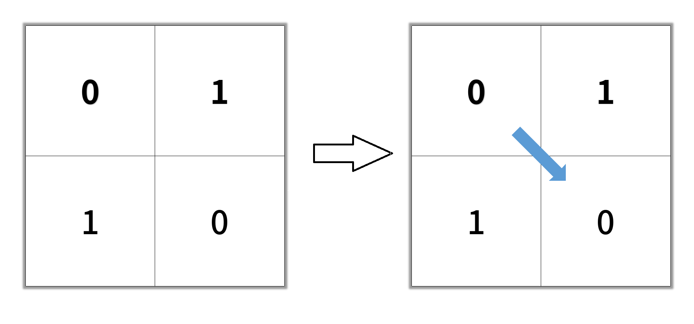

# [1091. Shortest Path in Binary Matrix](https://leetcode.com/problems/shortest-path-in-binary-matrix/description)

Given an `n x n` binary matrix `grid`, return the length of the shortest **clear path** in the matrix. If there is no clear path, return `-1`.

A **clear path** in a binary matrix is a path from the **top-left** cell (i.e., `(0, 0)`) to the bottom-right cell (i.e., `(n - 1, n - 1)`) such that:

- All the visited cells of the path are `0`.
- All the adjacent cells of the path are **8-directionally** connected (i.e., they are different and they share an edge or a corner).

The **length of a clear path** is the number of visited cells of this path.


### Example 1:

> Input: grid = [[0,1],[1,0]]
>
> Output: 2


### Example 2:

> Input: grid = [[0,0,0],[1,1,0],[1,1,0]]
>
> Output: 4


### Example 3:
> Input: grid = [[1,0,0],[1,1,0],[1,1,0]]
>
> Output: -1
 

### Constraints:
- `n == grid.length`
- `n == grid[i].length`
- `1 <= n <= 100`
- `grid[i][j]` is `0` or `1`


## Solutions

### Performance

- **Time Complexity**: $O(ROWS * COLS)$
- **Space Complexity**: $O(ROWS * COLS)$

### Javascript
```javascript
const shortestPathBinaryMatrix = (grid) => {
  const ROWS = grid.length;
  const COLS = grid[0].length;
  const directions = [
    [0, 1],
    [1, 0],
    [0, -1],
    [-1, 0],
    [1, -1],
    [-1, 1],
    [1, 1],
    [-1, -1],
  ];

  if (grid[0][0] === 1 || grid[ROWS - 1][COLS - 1] === 1) {
    return -1;
  }

  const queue = [[0, 0]];
  grid[0][0] = 1;

  while (queue.length) {
    const [r, c] = queue.shift();

    if (r === ROWS - 1 && c === COLS - 1) {
      return grid[r][c];
    }

    for (let i = 0; i < directions.length; i++) {
      const [dr, dc] = directions[i];
      const row = r + dr;
      const col = c + dc;
      if (
        row >= 0 &&
        row < ROWS &&
        col >= 0 &&
        col <= COLS &&
        grid[row][col] === 0
      ) {
        queue.push([row, col]);
        grid[row][col] = grid[r][c] + 1;
      }
    }
  }

  return -1;
};
```

### Performance

- **Time Complexity**: $O(ROWS * COLS)$
- **Space Complexity**: $O(ROWS * COLS)$

### Python
```python

```