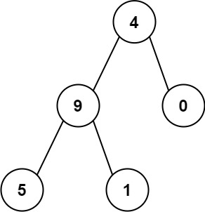

# [129. Sum Root to Leaf Numbers](https://leetcode.com/problems/sum-root-to-leaf-numbers/description/)

You are given the root of a binary tree containing digits from `0` to `9` only.

Each root-to-leaf path in the tree represents a number.

- For example, the root-to-leaf path `1 -> 2 -> 3` represents the number `123`.

Return the total sum of all root-to-leaf numbers. Test cases are generated so that the answer will fit in a **32-bit** integer.

A **leaf** node is a node with no children.


### Example 1:

> Input: root = [1,2,3]
>
> Output: 25
>
> Explanation:
>
> The root-to-leaf path 1->2 represents the number 12.
>
> The root-to-leaf path 1->3 represents the number 13.
>
> Therefore, sum = 12 + 13 = 25.


### Example 2:

> Input: root = [4,9,0,5,1]
>
> Output: 1026
>
> Explanation:
>
> The root-to-leaf path 4->9->5 represents the number 495.
>
> The root-to-leaf path 4->9->1 represents the number 491.
>
> The root-to-leaf path 4->0 represents the number 40.
>
> Therefore, sum = 495 + 491 + 40 = 1026.


### Constraints:
- The number of nodes in the tree is in the range `[1, 1000]`.
- `0 <= Node.val <= 9`
- The depth of the tree will not exceed `10`.


## Solutions

### Javascript
```javascript
const sumNumbers = (root) => {
  let res = 0;
  const dfs = (node, curr) => {
    if (!node) {
      return;
    }

    let num = 10 * curr + node.val;
    if (!node.left && !node.right) {
      res += num;
    }

    if (node.left) {
      dfs(node.left, num);
    }

    if (node.right) {
      dfs(node.right, num);
    }
  };
  
  dfs(root, 0);
  return res;
};
```

### Python
```python
class Solution:
  def sumNumbers(self, root: Optional[TreeNode]) -> int:
    res = 0
    def dfs(node, curr):
      nonlocal res
      if not node:
        return
      
      num = curr * 10 + node.val
      if not node.left and not node.right:
        res += num
        return
      
      if node.left:
        dfs(node.left, num)
        
      if node.right:
        dfs(node.right, num)
        
    dfs(root, 0)
    return res
```