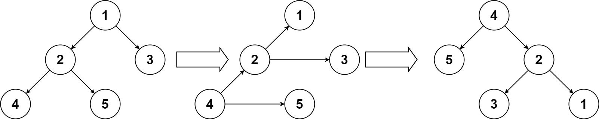

# [156. Binary Tree Upside Down](https://leetcode.com/problems/binary-tree-upside-down/description/)

Given a binary tree where all the right nodes are either leaf nodes with a sibling (a left node that shares the same parent node) or empty, flip it upside down and turn it into a tree where the original right nodes turned into left leaf nodes.

Return the new `root`.

### Example 1:

Given a binary tree `[1, 2, 3, 4, 5]`,
```
    1
   / \
  2   3
 / \
4   5
```
return the root of the binary tree `[4, 5, 2, #, #, 3, 1]`.
```
  4
 / \
5   2
   / \
  3   1
```


## Solutions

### Javascript
```javascript
const upsideDownBinaryTree = (root) => {
  if (!root || !root.left) {
    return root;
  }

  let leftChild = root.left;
  let rightChild = root.right;

  let newRoot = upsideDownBinaryTree(leftChild);

  leftChild.right = root;
  leftChild.left = rightChild;
  root.left = null;
  root.right = null;

  return newRoot;
};
```

### Python
```python
class Solution:
  def upsideDownBinaryTree(self, root: Optional[TreeNode]) -> Optional[TreeNode]:
    if not root or not root.left:
      return root
    
    leftChild = root.left
    rightChild = root.right
    
    newRoot = self.upsideDownBinaryTree(leftChild)

    leftChild.right = root
    leftChild.left = rightChild
    root.left = None
    root.right = None

    return newRoot
```