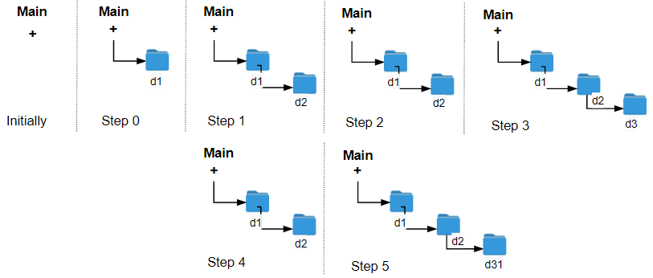

# [1598. Crawler Log Folder](https://leetcode.com/problems/crawler-log-folder/description/)

The Leetcode file system keeps a log each time some user performs a change folder operation.

The operations are described below:

- "../" : Move to the parent folder of the current folder. (If you are already in the main folder, **remain in the same folder**).
- "./" : Remain in the same folder.
- "x/" : Move to the child folder named `x` (This folder is guaranteed to always exist).

You are given a list of strings `logs` where `logs[i]` is the operation performed by the user at the $i^{th}$ step.

The file system starts in the main folder, then the operations in `logs` are performed.

Return the minimum number of operations needed to go back to the main folder after the change folder operations.


### Example 1:

> Input: logs = ["d1/","d2/","../","d21/","./"]
>
> Output: 2
>
> Explanation: Use this change folder operation "../" 2 times and go back to the main folder.


### Example 2:

> Input: logs = ["d1/","d2/","./","d3/","../","d31/"]
>
> Output: 3


### Example 3:
> Input: logs = ["d1/","../","../","../"]
>
> Output: 0


### Constraints:
- $1 <= logs.length <= 10^3$
- `2 <= logs[i].length <= 10`
- `logs[i]` contains lowercase English letters, digits, `'.'`, and `'/'`.
- `logs[i]` follows the format described in the statement.
- Folder names consist of lowercase English letters and digits.


## Solutions

### Performance

- **Time Complexity**: `O(n)`
- **Space Complexity**: `O(1)`

### Javascript
```javascript
const minOperations = (logs) => {
  let minOpCnt = 0;

  for (let i = 0; i < logs.length; i++) {
    if (logs[i] === "../") {
      minOpCnt -= minOpCnt > 0 ? 1 : 0;
    } else if (logs[i] !== "./") {
      minOpCnt++;
    }
  }

  return minOpCnt;
};
```

### Performance

- **Time Complexity**: `O(n)`
- **Space Complexity**: `O(1)`

### Python
```python
class Solution:
  def minOperations(self, logs: List[str]) -> int:
    minOpCnt = 0

    for op in logs:
      if op == '../':
        minOpCnt -= 1 if minOpCnt > 0 else 0
      elif op != './':
        minOpCnt += 1

    return minOpCnt
```