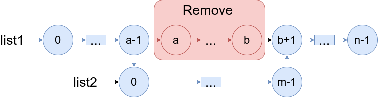
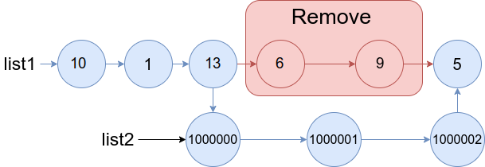

# [1669. Merge In Between Linked Lists](https://leetcode.com/problems/merge-in-between-linked-lists/description/)

You are given two linked lists: `list1` and `list2` of sizes n and m respectively.

Remove `list1`'s nodes from the $a^{th}$ node to the $b^{th}$ node, and put `list2` in their place.

The blue edges and nodes in the following figure indicate the result:

Build the result list and return its head.


### Example 1:

> Input: list1 = [10,1,13,6,9,5], a = 3, b = 4, list2 = [1000000,1000001,1000002]
>
> Output: [10,1,13,1000000,1000001,1000002,5]
>
> Explanation: We remove the nodes 3 and 4 and put the entire list2 in their place. The blue edges and nodes in the above figure indicate the result.


### Example 2:

> Input: list1 = [0,1,2,3,4,5,6], a = 2, b = 5, list2 = [1000000,1000001,1000002,1000003,1000004]
>
> Output: [0,1,1000000,1000001,1000002,1000003,1000004,6]
>
> Explanation: The blue edges and nodes in the above figure indicate the result.
 

### Constraints:
- `3 <= list1.length <=` $10^4$
- `1 <= a <= b < list1.length - 1`
- `1 <= list2.length <=` $10^4$


## Solutions

### Performance

- **Time Complexity**: $O(n + m)$
- **Space Complexity**: $O(1)$

### Javascript
```javascript
const mergeInBetween = (list1, a, b, list2) => {
  let list1AthNode = list1;
  let list1BthNode = list1;

  a--;
  while (a > 0) {
    list1AthNode = list1AthNode.next;
    a--;
  }

  b++;
  while (b > 0) {
    list1BthNode = list1BthNode.next;
    b--;
  }

  let list2LastNode = list2
  while (list2LastNode.next) {
    list2LastNode = list2LastNode.next
  }

  list1AthNode.next = list2
  list2LastNode.next = list1BthNode

  return list1
};
```

### Performance

- **Time Complexity**: $O(n + m)$
- **Space Complexity**: $O(1)$

### Python
```python
class Solution:
  def mergeInBetween(self, list1: ListNode, a: int, b: int, list2: ListNode) -> ListNode:
    list1AthNode = list1
    list1BthNode = list1
  
    a -= 1
    while a > 0:
      list1AthNode = list1AthNode.next
      a -= 1

    b += 1
    while b > 0:
      list1BthNode = list1BthNode.next
      b -= 1

    list2LastNode = list2
    while list2LastNode.next:
      list2LastNode = list2LastNode.next

    list1AthNode.next = list2
    list2LastNode.next = list1BthNode

    return list1
```