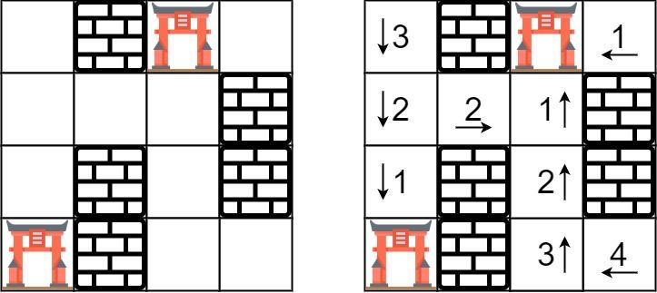

# [286. Walls and Gates](https://leetcode.com/problems/walls-and-gates/description/)

You are given a `m x n` 2D grid initialized with these three possible values.

- `-1` - A wall or an obstacle.
- `0` - A gate.
- `INF` - Infinity means an empty room. We use the value $2^{31}$ `- 1 = 2147483647` to represent INF as you may assume that the distance to a gate is less than `2147483647`.

Fill each empty room with the distance to **its nearest gate**. If it is impossible to reach a gate, it should be filled with `INF`.


### Example 1:

> Input: [[2147483647,-1,0,2147483647],[2147483647,2147483647,2147483647,-1],[2147483647,-1,2147483647,-1],[0,-1,2147483647,2147483647]]
>
> Output: [[3,-1,0,1],[2,2,1,-1],[1,-1,2,-1],[0,-1,3,4]]
>
> Explanation:
>
> the 2D grid is:
>
> INF  -1  0  INF
>
> INF INF INF  -1
>
> INF  -1 INF  -1
>
>   0  -1 INF INF
>
> the answer is:
>
>  3  -1   0   1
>
>  2   2   1  -1
>
>  1  -1   2  -1
>
>  0  -1   3   4


### Example 1:
> Input: [[0,-1],[2147483647,2147483647]]
>
> Output: [[0,-1],[1,2]]


### Constraints:
- `m == rooms.length`
- `n == rooms[i].length`
- `1 <= m, n <= 250`
- `rooms[i][j]` is `-1`, `0`, or $2^{31}$ `- 1`.

## Solutions

### Javascript
```javascript
const wallsAndGates = (rooms) => {
  const ROWS = rooms.length;
  const COLS = rooms[0].length;

  const q = [];
  const visited = new Set();

  const adRoom = (r, c) => {
    if (r < 0 || r === ROWS || c < 0 || c === COLS || visited.has(`${r}-${c}`) || rooms[r][c] === -1) {
      return;
    }
    visited.add(`${r}-${c}`);
    q.push([r, c]);
  };

  for (let r = 0; r < ROWS; r++) {
    for (let c = 0; c < COLS; c++) {
      if (rooms[r][c] === 0) {
        q.push([r, c]);
        visited.add(`${r}-${c}`);
      }
    }
  }

  let dist = 0;
  while (q.length) {
    const currentLength = q.length;
    for (let i = 0; i < currentLength; i++) {
      const [r, c] = q.shift();
      rooms[r][c] = dist;
      adRoom(r + 1, c);
      adRoom(r - 1, c);
      adRoom(r, c - 1);
      adRoom(r, c + 1);
    }
    dist++;
  }
};
```

### Python
```python
class Solution:
  def wallsAndGates(self, rooms: List[List[int]]) -> None:
    """
    Do not return anything, modify rooms in-place instead.
    """
    ROWS, COLS = len(rooms), len(rooms[0])
    visited = set()
    q = deque()

    def addRoom(r, c):
      if (r < 0 or r == ROWS or c < 0 or c == COLS or
        (r, c) in visited or rooms[r][c] == -1):
        return
      visited.add((r, c))
      q.append([r, c])

    for r in range(ROWS):
      for c in range(COLS):
        if rooms[r][c] == 0:
          q.append([r, c])
          visited.add((r, c))

    dist = 0
    while q:
      for i in range(len(q)):
        r, c = q.popleft()
        rooms[r][c] = dist
        addRoom(r, c + 1)
        addRoom(r, c - 1)
        addRoom(r + 1, c)
        addRoom(r - 1, c)
      dist += 1
```