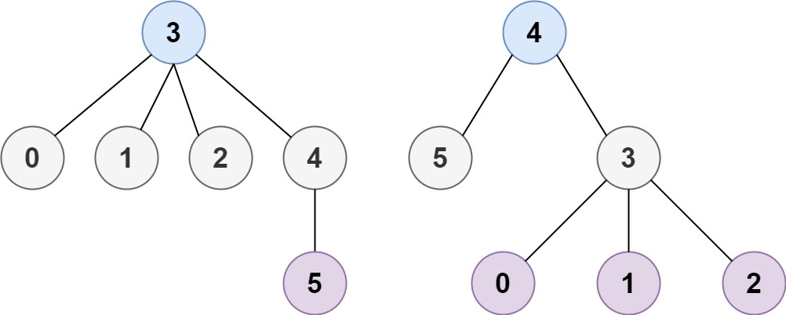

# [310. Minimum Height Trees](https://leetcode.com/problems/minimum-height-trees/description/)

A tree is an undirected graph in which any two vertices are connected by exactly one path. In other words, any connected graph without simple cycles is a tree.

Given a tree of n nodes labelled from `0` to `n - 1`, and an array of `n - 1` edges where `edges[i] = [`$a_i$, $b_i$`]` indicates that there is an undirected edge between the two nodes $a_i$ and $b_i$ in the tree, you can choose any node of the tree as the root. When you select a node `x` as the root, the result tree has height `h`. Among all possible rooted trees, those with minimum height (i.e. `min(h)`)  are called **minimum height trees** (MHTs).

Return a list of all **MHTs'** root labels. You can return the answer in **any order**.

The **height** of a rooted tree is the number of edges on the longest downward path between the root and a leaf.

### Example 1:

> Input: n = 4, edges = [[1,0],[1,2],[1,3]]
>
> Output: [1]
>
> Explanation: As shown, the height of the tree is 1 when the root is the node with label 1 which is the only MHT.

### Example 2:

> Input: n = 6, edges = [[3,0],[3,1],[3,2],[3,4],[5,4]]
>
> Output: [3,4]
 

### Constraints:
- `1 <= n <= 2 *` $10^4$
- `edges.length == n - 1`
- `0 <=` $a_i$, $b_i$ `< n`
- $a_i$ `!=` $b_i$
- All the pairs ($a_i$, $b_i$) are distinct.
- The given input is **guaranteed** to be a tree and there will be **no repeated** edges.
