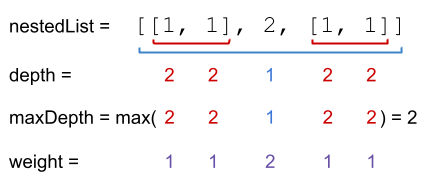

# [364. Nested List Weight Sum II](https://leetcode.com/problems/nested-list-weight-sum-ii/description/)

You are given a nested list of integers `nestedList`. Each element is either an integer or a list whose elements may also be integers or other lists.

The depth of an integer is the number of lists that it is inside of. For example, the nested list `[1,[2,2],[[3],2],1]` has each integer's value set to its **depth**. Let `maxDepth` be the **maximum depth** of any integer.

The **weight** of an integer is `maxDepth - (the depth of the integer) + 1`.

Return the sum of each integer in `nestedList` multiplied by its weight.


### Example 1:

> Input: nestedList = [[1,1],2,[1,1]]
>
> Output: 8
>
> Explanation: Four 1's with a weight of 1, one 2 with a weight of 2.
>
> 1*1 + 1*1 + 2*2 + 1*1 + 1*1 = 8


### Example 1:

> Input: nestedList = [1,[4,[6]]]
>
> Output: 17
>
> Explanation: One 1 at depth 3, one 4 at depth 2, and one 6 at depth 1.
>
> 1*3 + 4*2 + 6*1 = 17
 

### Constraints:
- `1 <= nestedList.length <= 50`
- The values of the integers in the nested list is in the range `[-100, 100]`.
- The maximum **depth** of any integer is less than or equal to `50`.


## Solutions

### Performance

- **Time Complexity**: $O(n)$
- **Space Complexity**: $O(n)$

### Javascript

```javascript
const depthSumInverse = (nestedList) => {
  const getDepthMax = (nestedList) => {
    let max = 1;
    for (let item of nestedList) {
      if (!item.isInteger() && item.getList().length > 0) {
        max = Math.max(max, 1 + getDepthMax(item.getList()));
      }
    }

    return max;
  };

  const sumDepthNestedList = (nestedList, maxDepth) => {
    let sum = 0;
    for (let item of nestedList) {
      if (item.isInteger()) {
        sum += maxDepth * item.getInteger();
      } else {
        sum += sumDepthNestedList(item.getList(), maxDepth - 1);
      }
    }

    return sum;
  }

  const maxDepth = getDepthMax(nestedList);
  return sumDepthNestedList(nestedList, maxDepth);
};
```

### Performance

- **Time Complexity**: $O(n)$
- **Space Complexity**: $O(n)$

### Python

```python
class Solution:
  def depthSumInverse(self, nestedList) -> int:
    def getMaxDepth(nestedList):
      maxDepth = 1
      for item in nestedList:
        if not item.isInteger() and len(item.getList()) > 0:
          maxDepth = max(maxDepth, 1 + getMaxDepth(item.getList()))
      
      return maxDepth
    
    def sumDepthNestedList(nestedList, depth):
      sum = 0
      for item in nestedList:
        if item.isInteger():
          sum += item.getInteger() * depth
        else:
          sum += sumDepthNestedList(item.getList(), depth - 1)
      
      return sum
    
    maxDepth = getMaxDepth(nestedList)
      
    return sumDepthNestedList(nestedList, maxDepth)
```
