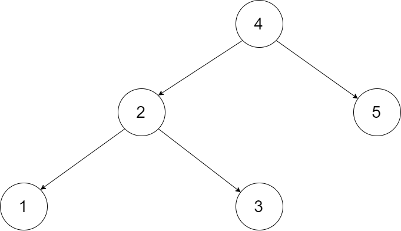

# [426. Convert Binary Search Tree to Sorted Doubly Linked List](https://leetcode.com/problems/convert-binary-search-tree-to-sorted-doubly-linked-list/description)

Convert a **Binary Search Tree** to a sorted **Circular Doubly-Linked List** in place.

You can think of the left and right pointers as synonymous to the predecessor and successor pointers in a doubly-linked list. For a circular doubly linked list, the predecessor of the first element is the last element, and the successor of the last element is the first element.

We want to do the transformation **in place**. After the transformation, the left pointer of the tree node should point to its predecessor, and the right pointer should point to its successor. You should return the pointer to the smallest element of the linked list.


### Example 1:

> Input: root = [4,2,5,1,3]
>
> 
>
> Output: [1,2,3,4,5]
>
> Explanation: The figure below shows the transformed BST. The solid line indicates the successor relationship, while the dashed line means the predecessor relationship.
>
> 


### Example 2:
> Input: root = [2,1,3]
>
> Output: [1,2,3]
 

### Constraints:
- The number of nodes in the tree is in the range `[0, 2000]`.
- `-1000 <= Node.val <= 1000`
- All the values of the tree are unique.


## Solutions

### Performance

- **Time Complexity**: $O(n)$
- **Space Complexity**: $O(n)$

### Javascript
```javascript
const treeToDoublyList = (root) => {
  if (!root) {
    return null;
  }
  let first = null;
  let last = null;
  const inOrderTraversal = (node) => {
    if (node) {
      inOrderTraversal(node.left);
      if (last) {
        last.right = node;
        node.left = last;
      } else {
        first = node;
      }
      last = node;
      inOrderTraversal(node.right);
    }
  };

  inOrderTraversal(root);
  last.right = first;
  first.left = last;

  return first;
};
```

### Performance

- **Time Complexity**: $O(n)$
- **Space Complexity**: $O(n)$

### Python
```python
class Solution:
  def treeToDoublyList(self, root: Optional[Node]) -> Optional[Node]:
    if not root:
      return None

    def inOrderTraversial(node):
      nonlocal first, last
      if node:
        inOrderTraversial(node.left)
        
        if last:
          last.right = node
          node.left = last
        else:
          first = node
        last = node
        
        inOrderTraversial(node.right)
    
    first, last = None, None  
    inOrderTraversial(root)
    first.left = last
    last.right = first

    return first
```
