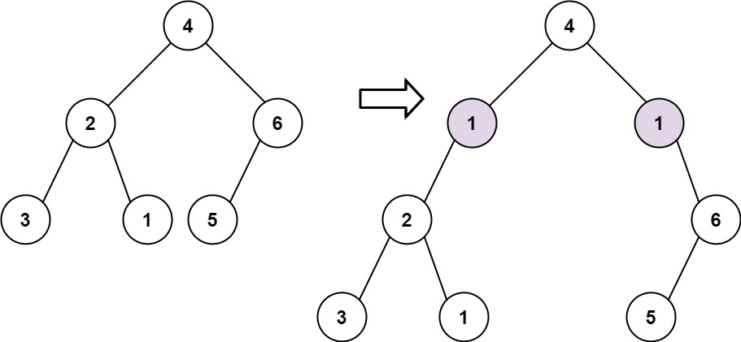

# [623. Add One Row to Tree](https://leetcode.com/problems/add-one-row-to-tree/description/)

Given the `root` of a binary tree and two integers `val` and `depth`, add a row of nodes with value `val` at the given depth `depth`.

Note that the `root` node is at depth `1`.

The adding rule is:

- Given the integer `depth`, for each not null tree node `cur` at the depth `depth - 1`, create two tree nodes with value `val` as `cur`'s left subtree root and right subtree root.
- `cur`'s original left subtree should be the left subtree of the new left subtree root.
- `cur`'s original right subtree should be the right subtree of the new right subtree root.
- If `depth == 1` that means there is no depth `depth - 1` at all, then create a tree node with value `val` as the new root of the whole original tree, and the original tree is the new root's left subtree.


### Example 1:

> Input: root = [4,2,6,3,1,5], val = 1, depth = 2
>
> Output: [4,1,1,2,null,null,6,3,1,5]


### Example 2:

> Input: root = [4,2,null,3,1], val = 1, depth = 3
>
> Output: [4,2,null,1,1,3,null,null,1]
 

### Constraints:
- The number of nodes in the tree is in the range `[1, `$10^4$`]`.
- The depth of the tree is in the range `[1, `$10^4$`]`.
- `-100 <= Node.val <= 100`
- `-105 <= val <= 105`
- `1 <= depth <= the depth of tree + 1`


## Solutions

### Javascript
```javascript
const addOneRow = (root, val, depth) => {
  if (depth === 1) {
    const newNode = new TreeNode(val);
    newNode.left = root;
    return newNode;
  }

  const q = [[root, 1]];

  while (q.length) {
    const [node, currentDepth] = q.pop();
    if (currentDepth === depth - 1) {
      const newLeftNode = new TreeNode(val);
      const newRightNode = new TreeNode(val);

      const leftNode = node.left;
      const rightNode = node.right;

      node.left = newLeftNode;
      node.right = newRightNode;

      node.left.left = leftNode;
      node.right.right = rightNode;
    } else {
      if (node.left) {
        q.push([node.left, currentDepth + 1]);
      }

      if (node.right) {
        q.push([node.right, currentDepth + 1]);
      }
    }
  }

  return root;
};
```

### Python
```python
class Solution:
  def addOneRow(self, root: Optional[TreeNode], val: int, depth: int) -> Optional[TreeNode]:
    if not root:
      return TreeNode(val)
    
    if depth == 1:
      newNode = TreeNode(val)
      newNode.left = root
      return newNode
    
    q = [(root, 1)]
    
    while q:
      node, currentDepth = q.pop(0)
      if currentDepth == depth - 1:
        newLeftNode = TreeNode(val)
        newRightNode = TreeNode(val)

        leftNode = node.left
        rightNode = node.right

        node.left = newLeftNode
        node.right = newRightNode
        
        node.left.left = leftNode
        node.right.right = rightNode
      else:
        if node.left:
          q.append([node.left, currentDepth + 1])
          
        if node.right:
          q.append([node.right, currentDepth + 1])
          
    return root
```