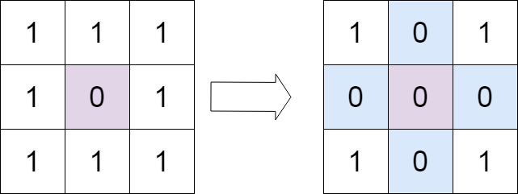

# [73. Set Matrix Zeroes](https://leetcode.com/problems/set-matrix-zeroes/description/)

Given an `m x n` integer matrix `matrix`, if an element is `0`, set its entire row and column to `0`'s.

You must do it [in place](https://en.wikipedia.org/wiki/In-place_algorithm).


### Example 1:

> Input: matrix = [[1,1,1],[1,0,1],[1,1,1]]
>
> Output: [[1,0,1],[0,0,0],[1,0,1]]


### Example 2:

> Input: matrix = [[0,1,2,0],[3,4,5,2],[1,3,1,5]]
>
> Output: [[0,0,0,0],[0,4,5,0],[0,3,1,0]]
 

### Constraints:
- `m == matrix.length`
- `n == matrix[0].length`
- `1 <= m, n <= 200`
- $2^{31} <= matrix[i][j] <= 2^{31} - 1$


### Follow up:
- A straightforward solution using O(mn) space is probably a bad idea.
- A simple improvement uses O(m + n) space, but still not the best solution.
- Could you devise a constant space solution?


## Solutions

### Performance

- **Time Complexity**: `O(N * M)`
- **Space Complexity**: `O(1)`

### Javascript
```javascript
const setZeroes = (matrix) => {
  const ROWS = matrix.length;
  const COLS = matrix[0].length;
  let firstRowHasZero = false;
  let firstColHasZero = false;

  for (let r = 0; r < ROWS; r++) {
    if (matrix[r][0] === 0) {
      firstColHasZero = true;
      break;
    }
  }
  
  for (let c = 0; c < COLS; c++) {
    if (matrix[0][c] === 0) {
      firstRowHasZero = true;
      break;
    }
  }

  for (let r = 1; r < ROWS; r++) {
    for (let c = 1; c < COLS; c++) {
      if (matrix[r][c] === 0) {
        matrix[0][c] = 0;
        matrix[r][0] = 0;
      }
    }
  }

  for (let r = 1; r < ROWS; r++) {
    for (let c = 1; c < COLS; c++) {
      if (matrix[0][c] === 0 || matrix[r][0] === 0) {
        matrix[r][c] = 0;
      }
    }
  }

  if (firstColHasZero) {
    for (let r = 0; r < ROWS; r++) {
      matrix[r][0] = 0;
    }
  }

  if (firstRowHasZero) {
    for (let c = 0; c < COLS; c++) {
      matrix[0][c] = 0;
    }
  }
};
```

### Performance

- **Time Complexity**: `O(N * M)`
- **Space Complexity**: `O(1)`

### Python
```python
class Solution:
  def setZeroes(self, matrix: List[List[int]]) -> None:
    """
    Do not return anything, modify matrix in-place instead.
    """
    ROWS = len(matrix)
    COLS = len(matrix[0])
    firstRowHasZero = False
    firstColHasZero = False
    
    for r in range(ROWS):
      if matrix[r][0] == 0:
        firstColHasZero = True
        break
    
    for c in range(COLS):
      if matrix[0][c] == 0:
        firstRowHasZero = True
        break 
      
    for r in range(ROWS):
      for c in range(COLS):
        if matrix[r][c] == 0:
          matrix[r][0] = 0
          matrix[0][c] = 0
     
    for r in range(1, ROWS):
      for c in range(1, COLS):
        if matrix[r][0] == 0 or matrix[0][c] == 0:
          matrix[r][c] = 0
         
    if firstColHasZero: 
      for r in range(ROWS):
        matrix[r][0] = 0
        
    if firstRowHasZero:
      for c in range(COLS):
        matrix[0][c] = 0
```