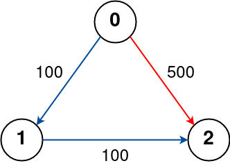

# [787. Cheapest Flights Within K Stops](https://leetcode.com/problems/cheapest-flights-within-k-stops/description/)

There are n cities connected by some number of flights. You are given an array `flights` where `flights[i] = [fromi, toi, pricei]` indicates that there is a flight from city `fromi` to city `toi` with cost `pricei`.

You are also given three integers `src`, `dst`, and `k`, return **the cheapest price** from `src` to `dst` with at most `k` stops. If there is no such route, return `-1`.


### Example 1:

> Input: `n = 4, flights = [[0,1,100], [1,2,100], [2,0,100], [1,3,600], [2,3,200]], src = 0, dst = 3, k = 1`
>
> Output: `700`
>
> Explanation:
>
> `The graph is shown above.`
>
> `The optimal path with at most 1 stop from city 0 to 3 is marked in red and has cost 100 + 600 = 700.`
>
> `Note that the path through cities [0,1,2,3] is cheaper but is invalid because it uses 2 stops.`

### Example 2

> Input: `n = 3, flights = [[0,1,100], [1,2,100], [0,2,500]], src = 0, dst = 2, k = 1`
>
> Output: `200`
>
> Explanation:
>
> `The graph is shown above.`
>
> `The optimal path with at most 1 stop from city 0 to 2 is marked in red and has cost 100 + 100 = 200.`


### Example 3

> Input: `n = 3, flights = [[0,1,100],[1,2,100],[0,2,500]], src = 0, dst = 2, k = 0`
>
> Output: `500`
>
> Explanation:
>
> `The graph is shown above.`
>
> `The optimal path with no stops from city 0 to 2 is marked in red and has cost 500.`


### Constraints:
- `1 <= n <= 100`
- `0 <= flights.length <= (n * (n - 1) / 2)`
- `flights[i].length == 3`
- `0 <= fromi, toi < n`
- `fromi != toi`
- `1 <= pricei <= 104`
- There will not be any multiple flights between two cities.
- `0 <= src, dst, k < n`
- `src != dst`


## Solutions

### Python ([Bellman–Ford algorithm](https://en.wikipedia.org/wiki/Bellman%E2%80%93Ford_algorithm))
```python
class Solution:
  def findCheapestPrice(self, n: int, flights: list[list[int]], src: int, dst: int, k: int) -> int:
    prices = [float("inf")] * n
    prices[src] = 0

    for i in range(k + 1):
      tempPrices = prices.copy()
      for s, d, p in flights:
        if prices[s] == float("inf"):
          continue

        if prices[s] + p < tempPrices[d]:
          tempPrices[d] = prices[s] + p

      prices = tempPrices

    return -1 if prices[dst] == float("inf") else prices[dst]
```

### Python ([Dijkstra's algorithm](https://en.wikipedia.org/wiki/Dijkstra%27s_algorithm))
```python
```