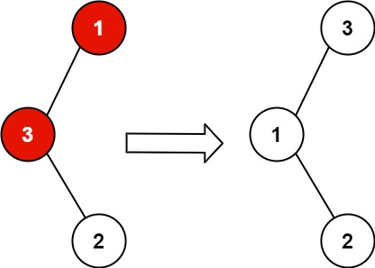
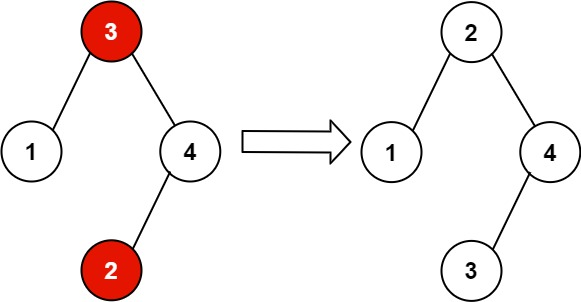

# [99. Recover Binary Search Tree](https://leetcode.com/problems/recover-binary-search-tree/description/)

You are given the `root` of a binary search tree (BST), where the values of **exactly** two nodes of the tree were swapped by mistake. Recover the tree without changing its structure.


### Example 1:

> Input: `root = [1,3,null,null,2]`
>
> Output: `[3,1,null,null,2]`
>
> Explanation: `3 cannot be a left child of 1 because 3 > 1. Swapping 1 and 3 makes the BST valid.`


### Example 2:

> Input: `root = [3,1,4,null,null,2]`
>
> Output: `[2,1,4,null,null,3]`
>
> Explanation: `2 cannot be in the right subtree of 3 because 2 < 3. Swapping 2 and 3 makes the BST valid.`


### Constraints:
> The number of nodes in the tree is in the range `[2, 1000]`.
> `-2^31 <= Node.val <= 2^31 - 1`
 

**Follow up:** A solution using `O(n)` space is pretty straight-forward. Could you devise a constant `O(1)` space solution?


## Solutions

### Javascript
```javascript
const recoverTree = (root) => {
  let prev = null;
  let first = null;
  let second = null;

  const inorder = (node) => {
    if (!node) {
      return;
    }

    inorder(node.left);

    if (prev && prev.val > node.val) {
      if (!first) {
        first = prev;
      }
      second = node;
    }
    prev = node;

    inorder(node.right);
  }

  inorder(root);

  [first.val, second.val] = [second.val, first.val]

  return root;
};
```

### Python
```python
class Solution:
  def recoverTree(self, root: Optional[TreeNode]) -> None:
    """
    Do not return anything, modify root in-place instead.
    """
    def inorder(node):
      if not node:
        return

      inorder(node.left)

      if self.prev and self.prev.val > node.val:
        if not self.first:
          self.first = self.prev
        self.second = node
      self.prev = node

      inorder(node.right)
    
    self.prev = None
    self.first = None
    self.second = None

    inorder(root)

    self.first.val, self.second.val = self.second.val, self.first.val
  
    return root
```